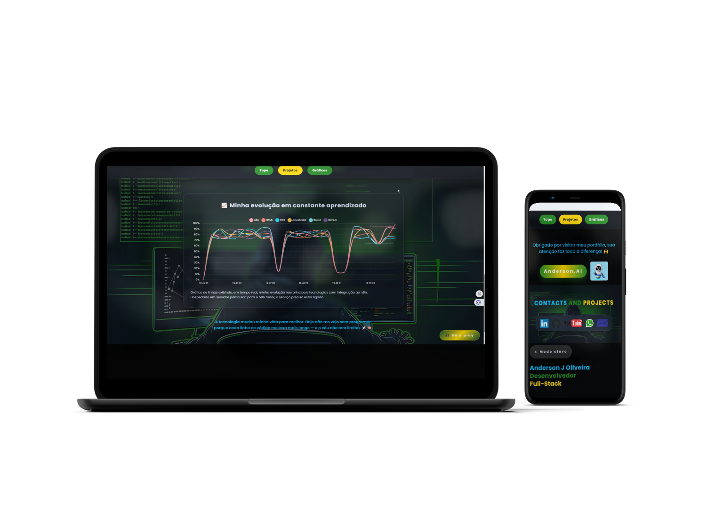

<!-- START: HERO -->
<h1 align="center">
  
  &nbsp;Oi, eu sou o Anderson — Desenvolvedor Web Júnior
</h1>

<!-- Mockup clicável (abre o portfólio) -->

  

<!-- Linha de digitação (typing) — maior -->

  

<!-- END: HERO -->

---

## 🔧 Skills (núcleo)
<!-- badges principais -->

## 🎨 Front-End & Ferramentas

## ⚙️ Automação & Integrações

---

## 📊 Estatísticas

  
  

  
  

---

## 🌟 Projeto em Destaque — Meu Portfólio
Criei um portfólio com foco em performance, responsividade e showcase de integrações (n8n, webhooks, IA).  
**Acesse:**  
- 🔗 **Online:** https://anderson0617.github.io/-meu-portfolio/  
- 💻 **Código:** https://github.com/Anderson0617/-meu-portfolio

> Dica: veja também os projetos **Mentor.Dev – Gerador**, **Dev-Burger-5.1** e **Cyber-Café-Dev** no meu GitHub.

---

## 🔗 Links principais
- 🌐 **Portfólio Online:** https://anderson0617.github.io/-meu-portfolio/  
- 💼 **LinkedIn:** https://www.linkedin.com/in/anderson-olivera-dev  
- ✉️ **Contato:** anderson0920485@gmail.com

---

## 🙌 Sobre mim
São José – SC. Em transição para tecnologia, apaixonado por criar soluções e automatizar processos.  
Aberto a colaboração, freelas e oportunidades. **Chama lá no LinkedIn!**

---

  

<!-- Rodapé: espaço para futuros banners/prints -->
<!-- Coloque assets próprios depois em /assets e referencie aqui -->
